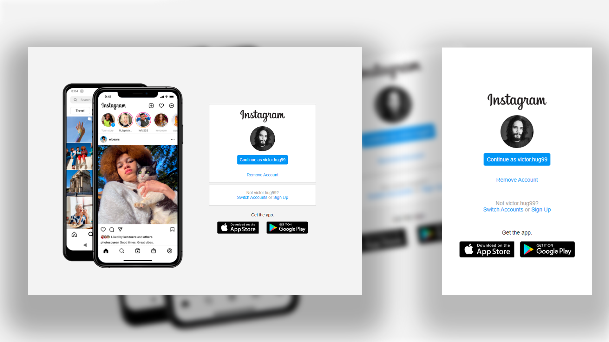

# 💻 | Projeto: Tela de Login do Instagram - Desafio DIO.

### Projeto integrador feito para por em prática as aulas:  Posicionando elementos com Flexbox em CSS.

Seja bem vindo ao meu projeto chamado "Tela de Login do Instagram", feito totalmente para meus estudos e aperfeiçoamento como profissional. ❤️

- Colocando em prática conceitos obtidos durante a aula.

- Utilizando: HTML, CSS.

### 📸 | Screenshots: 

## 👩‍💻 Meus Links:

- Github: [Victor Hugo.](https://github.com/torugo99)
- LinkedIn: [Victor Hugo.](https://www.linkedin.com/in/victor-hugo99/)
- Meu Site: [Victor99dev.](http://victor99dev.site/)

### 😀 | Créditos e Agradecimentos:

- Obrigado a DIO a essa oportunidade de UP na minha carreira! ❤️